# Проводимые тесты

## Создание FIFO

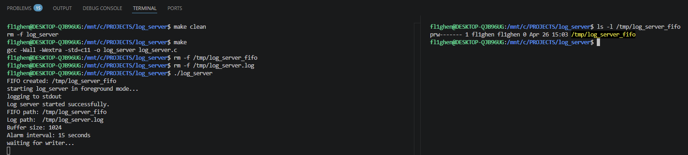

После запуска программы канал fifo успешно создался.

## Запуск с существующим FIFO

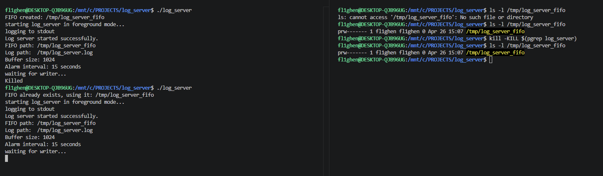

После запуска и создания fifo была послан сигнал kill, который никак не обрабатывается программой (т.е. fifo не будет удален). После повторного запуска программа использует существующий fifo, как и ожидалось.

## Запуск с некорректным файлом log_server_fifo

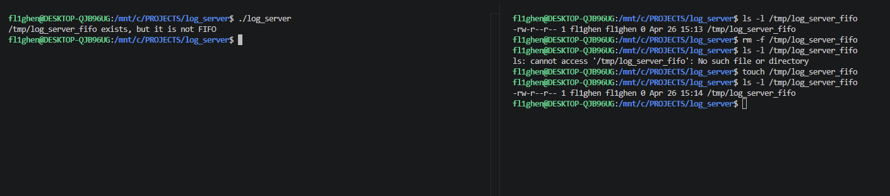

Как и ожидалось, программа проверила файл log_server_fifo, опознала, что это не fifo, завершила работу.

## Проверка вывода сообщений разной длины

### Тест ручного ввода

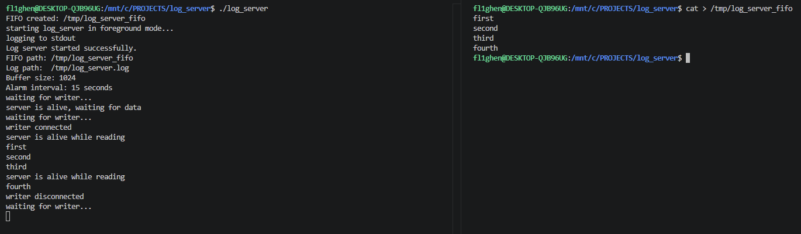

Сообщения корректно выводятся, программа каждые 15 секунд сообщает о своем существовании в режиме ожидания данных и во время принятия данных от "писателя".

### Тест echo

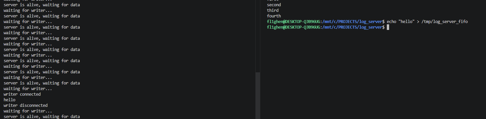

### Тест cat

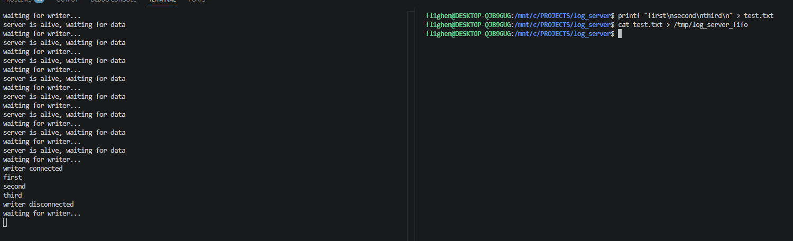

### Тест длинное сообщение

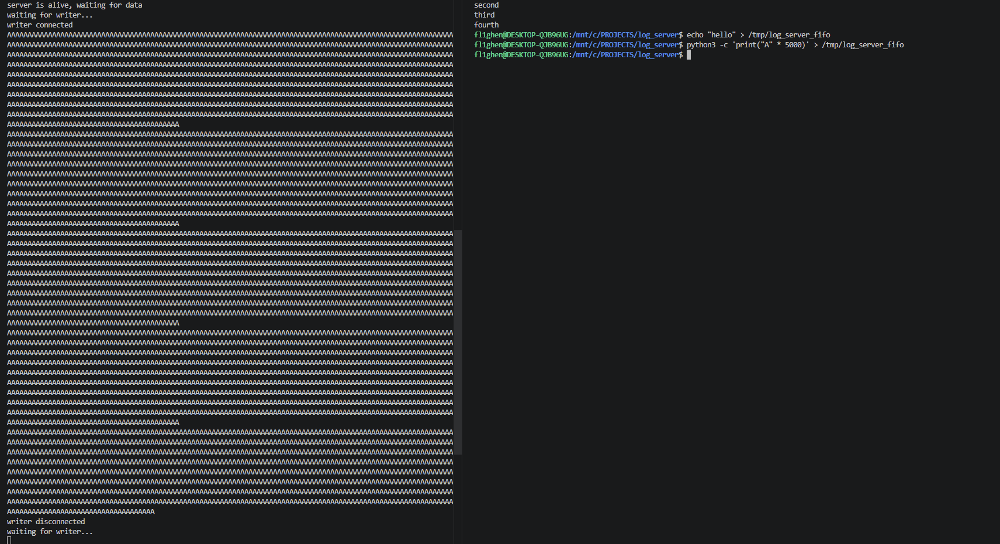

## Тесты получения сигналов

### Сигнал SIGINT

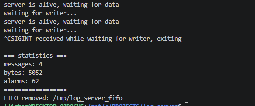

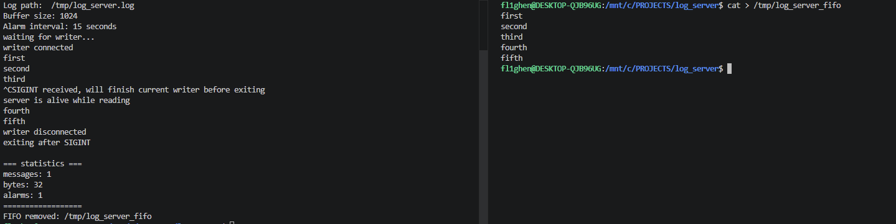

Сигнал SIGINT корректно обрабатывается: в момент ожидания данных завершение программы происходит сразу, во время активного чтения сначала заканчивает чтение, затем корректно завершается.

### Сигнал SIGTERM

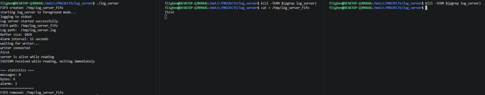

### Сигнал SIGQUIT

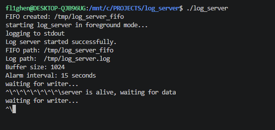

Сигнал SIGQUIT игнорируется.

### Сигнал SIGUSR1

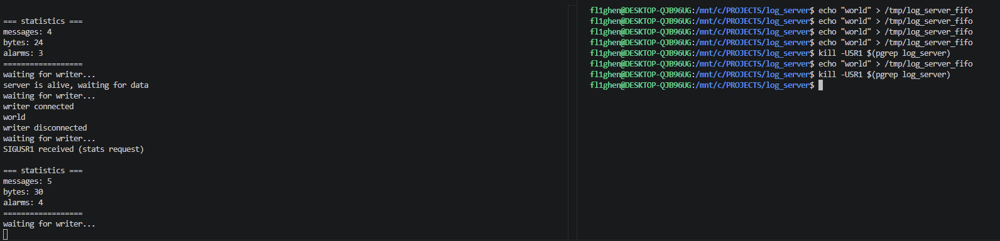

Получение статистики по запросу обрабатывается корректно, поля статистики обновляются корректно.

### Сигнал SIGHUP

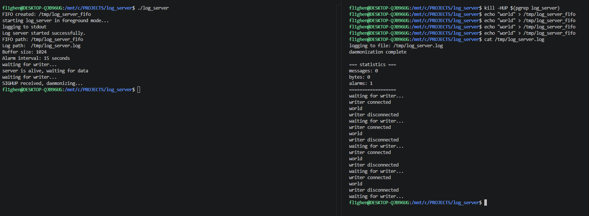

При получении SIGHUP (сигнал, который получает программа и при закрытии терминала) процесс демонизируется: выполняется fork, родительский процесс завершается, 
дочерний процесс отвязывается от терминала (setsid) и перенаправляет stdout/stderr в файл. 
После этого программа продолжает работу в фоновом режиме.

## Запуск процесса-демона

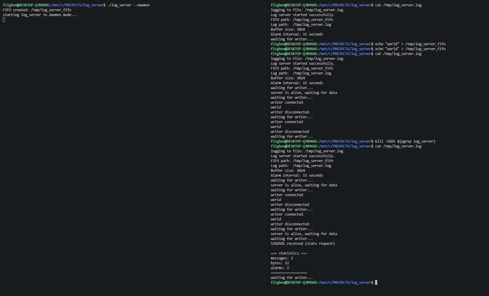

# Cложности при реализации.

В ходе реализации была сложность с компиляцией: при использовании флага `-std=c11` нужно было добавить `#define _POSIX_C_SOURCE 200809L`, иначе компилятор не видел `struct sigaction`, `sigaction()`, `sigemptyset()`. Позже понял, что можно было компилировать с `-std=gnu11`, тогда объявления `POSIX API` будут включены.
